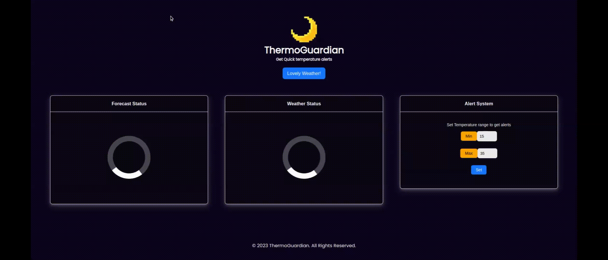

# Weather Agent
A weather agent notifier generated and monitored by FetchAI's micro Agents. 


## Web App
[ThermoGuardian](https://weather-agent-client.vercel.app/) has been developed using ReactJS and deployed on Vercel.  
The web app is a simple UI to interact with the agent. It allows the user to set the temperature threshold and the 
location. The agent will notify the user when the temperature is out of the range-bounds.



**The theme of the app responds in real-time.** The background changes based on the time-zone of the location. 
It changes to Night or Day theme based on the timing of the users location.

## The API
The API is developed using FastAPI. It has simple REST API endpoints:
* `/`: GET Method. Fetch the alert message processed by the Agents and monitoring the temperature of user set Location continuously in the backend server.
* '/limit': POST Method. Store the User Query for the MIN and MAX temperature limit values along with location.

## GET STARTED 
#### Prerequisites
* Install the project dependencies via Poetry
  1. Install Poetry: Poetry is a Python package manager that makes it easy to install and manage Python dependencies. You can install Poetry using the following command: 
    ```
    $ pip install poetry --no-interaction --no-root
    ```
  2. Install the dependencies listed in the pyproject.toml file. You can do this using the following command::  
  ```
    $ poetry install
  ```
  3. In case of poetry lock dependency errors. Refresh the `poetry.lock` file using the command:
  ```
  $ poetry lock --no-update
  ```
  **Alternative:** You can also install via Pip package manager.
  ```
  $ pip install ---upgrade -r requirements.txt
  ```
<br>

* Create a `.env` file in under /weatherAgent (equivalent to `src` directory level)
* Add the `WEATHER_API_KEY` environment variable. To get your API key, visit [WeatherAPI](https://www.weatherapi.com/) <br>
```
WEATHER_API_KEY=...
```
  NOTE: This project supports the usage of only FREE API.

<br>

## Run the API
The FAST API server can be run in following ways:
1. The ThermoGuardian Web app can be accessed through this [url](https://weather-agent-client.vercel.app/) which is a single page app implementing the required features in the frontend.
2. To run locally: Execute the bash script `script.sh`
```
$ sh script.sh
```

3. Run with docker: Use to deploy on a cloud container service. Pull the docker image file and run the container using below commands:
```
$ docker pull p1utoze/thermoguardian:latest
$ docker run -p 8080:8080 --env-file .env p1utoze/thermoguardian
```
Make sure you have created the .env file.
 

### Teach Stack
1. ReactJS
2. IPv4 and Weather API
3. uAgent supported FastAPI server


## Project Scope:
* Currently the project uses fast JSON serialization library written in RUST- `orjson` to store the user requests. To scale the project. Redis In-memory storage can be used.
* The project is limited to few user requests. The API is deployed on Azure Web App services F1 free tier. A user database can be created using NoSQL databases.
* The uAgent library is a close-end library with no scope for integration with other frameworks. It supports Remote Agents but is limited to the same ecosystem based off Almanac contract
  which requires the Context to be passed between agents.
  
